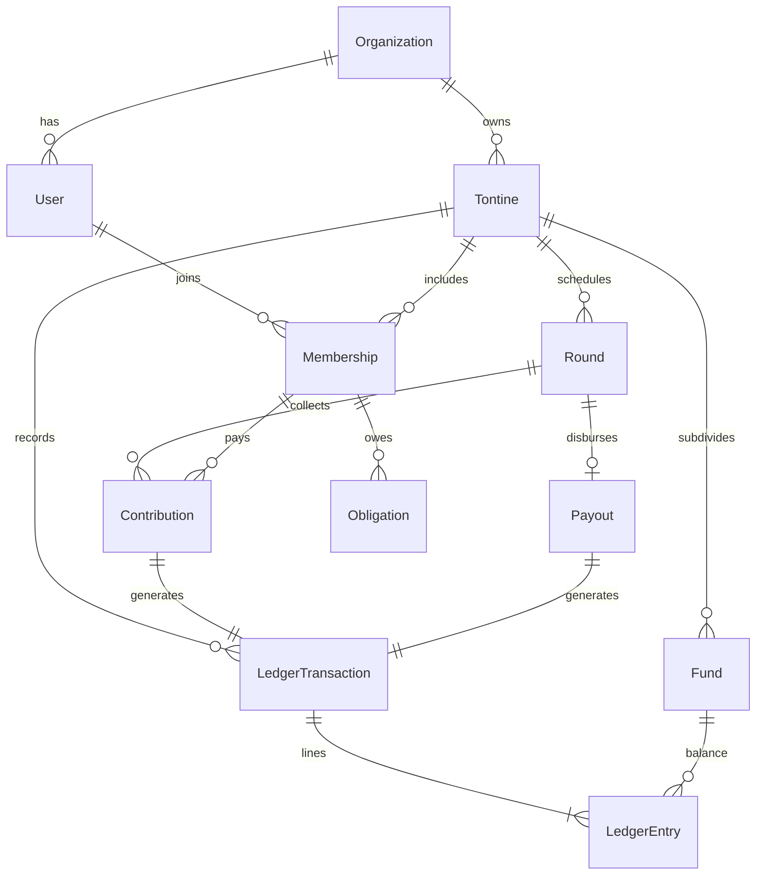

# Nkap — Modèle de domaine (source de vérité)

> 🕒 **Révision** — dernière MAJ : [Claude] 2026-06-14 06:20 (UTC+1). 🔒 Catalogue synchronisé avec le modèle UML verrouillé (BC1/BC3/BC5 + `FundType.PLATFORM`). Journal complet : [JOURNAL.md](JOURNAL.md).

> Document canonique partagé entre **Chris**, **Claude** (architecture/logique métier) et **Gemini/Antigravity** (scaffold/boilerplate).
> Règle d'or : avant une grosse tâche, on lit ce doc ; après, on le met à jour. Toute décision importante va dans `DECISIONS.md`.

Stack actée : **NestJS (Node 20) en architecture microservices + TypeORM + MySQL 8 (DDD)** côté serveur, **Angular 20** côté web. ⚠️ Le **cœur financier (tontine + ledger + paiements) reste dans un seul service ACID** — voir la décomposition dans [MODELISATION_UML.md](MODELISATION_UML.md).
Langue : doc en français, identifiants de code en anglais.

---

## 0. Principe directeur — « gérer tous les cas »

On ne code **pas** un type de tontine en dur. On sépare trois choses :

1. **Structure** — qui, quel groupe, quels membres (stable).
2. **Règles** — comment la tontine se comporte (configurable + Strategy par type).
3. **Événements** — ce qui s'est réellement passé : le **registre append-only** (la source de confiance).

Ajouter un nouveau cas d'usage = une nouvelle _Strategy_ + de la _config_, **pas** une migration de schéma douloureuse.

---

## 1. Entités

### Identité & structure

- **User** — identité d'authentification. `phone` = **identifiant principal** (marché CM ⇒ téléphone > email), `email` (optionnel), `fullName`, `passwordHash`, `locale`, `status`. Vérification par OTP SMS.
- **Organization** (tenant) — l'association / le groupe propriétaire. Porte `organization_id` **partout** ⇒ isolation SaaS dès J1. Un particulier = une org à un membre.
- **Tontine** — une instance de scheme. `organization_id`, `type` (enum), `status`, `currency`, `config` (JSON règles), `startDate`, `frequency`.
- **Membership** (pivot User ↔ Tontine) — `role` (`PRESIDENT | TREASURER | SECRETARY | CENSOR | MEMBER`), `status` (`INVITED | PENDING_GUARANTEE | ACTIVE | SUSPENDED | LEFT | EXCLUDED`), `shares` (nombre de « mains »), `joinedAt`. Le rôle est **par tontine**, pas global.
- **Subscription** — abonnement SaaS d'une organisation. `plan` (`PlanType`), `status`, `periodStart/End`. (facturation codée en dernier.)
- **Sponsorship** (garant / parrainage) — lie un `membership` à un `guarantorMembershipId`. Multi-garants possibles ; déclenche l'état `PENDING_GUARANTEE` du membre.

### Moteur de règles (adaptabilité)

- **TontineType** (Strategy) : `ROTATING` (tour de rôle) · `AUCTION` (enchères) · `ACCUMULATING` (ASCA : épargne + prêts) · `SOLIDARITY_FUND` (caisse de secours). Chaque type = une classe implémentant le cycle de vie (`computeDue`, `determineBeneficiary`, `computePenalty`, `computePayout`). DB stable, comportement interchangeable.
- **Frequency** (value object) : `{ interval: number, unit: DAY|WEEK|MONTH, anchorDate }`. La génération du calendrier des rounds est une **fonction pure** ⇒ facile à tester.
- **Config règles** (JSON typé, = `RuleSet`) : montant par part · ordre de bénéfice (`FIXED | RANDOM_DRAW | AUCTION | NEED_BASED`) · pénalité (fixe ou %, délai de grâce) · taux d'intérêt (ASCA) · cotisation de solidarité · gouvernance (quorum) · prêt (plafond) · frais plateforme · **défaut membre** (`DefaultRule` : waterfall `[GUARANTOR → SAFETY_FUND → MUTUALIZE]` + exclusion, configurable).

### Cycle

- **Round** (séance / échéance) — `tontine_id`, `index`, `dueDate`, `expectedAmount`, `beneficiaryMembershipId?`, `status`.
- **Cycle** (optionnel) — un tour complet où chaque membre ramasse une fois.
- **BeneficiaryAssignment** — qui ramasse à un round et par quelle `method` (`FIXED | RANDOM_DRAW | AUCTION | NEED_BASED`).
- **Auction** / **Bid** (type enchères) — `Auction` par round (`openAt/closeAt`, `winningBidId`) ; `Bid` = offre d'un membre (le rabais), redistribuée aux autres.
- **ShareTransfer** (« achat de la main ») — cession d'une position : `fromMembershipId`, `toMembershipId`, `position`, `price` ; réaffecte la `BeneficiaryAssignment`.

### Argent — le registre = cœur de confiance _(modèle validé Claude + Gemini)_

- **Fund** (Caisse / sous-compte d'une tontine) — `tontine_id`, `name`, `type` (`MAIN | SOCIAL | PENALTY | SAVINGS | PLATFORM`), `cachedBalance`. Le solde est une **projection** = somme des `LedgerEntry` de la caisse, recalculée **dans la même transaction** que l'écriture — jamais une vérité indépendante.
- **LedgerTransaction** (mouvement atomique) — `tontine_id`, `type` (`TxType`), `createdBy`, `createdAt`, `description`. Contient `2..*` `LedgerEntry` dont **la somme signée vaut 0** ⇒ partie double, équilibre **prouvable par construction**.
- **LedgerEntry** (append-only, **immuable**) — `transaction_id`, `fund_id`, `membership_id?`, `amount` (**entier, plus petite unité**), `direction` (`DEBIT | CREDIT`, du point de vue de la caisse), `type` (`CONTRIBUTION | PAYOUT | PENALTY | FEE | LOAN_OUT | LOAN_REPAY | INTEREST | SOLIDARITY | TRANSFER`), `currency`, `reversedEntryId?`. **Jamais modifié** ⇒ correction = contre-passation liée par `reversedEntryId`.
- **Contribution** — cotisation d'un membre pour un round, vers une caisse cible. `round_id`, `membership_id`, `targetFundId`, `expectedAmount`, `paidAmount`, `method` (`CASH | MOMO | OM | BANK`), `status` (`PENDING | CONFIRMED | RECONCILED`), `externalRef`, `idempotencyKey`. Génère une `LedgerTransaction`.
- **Payout** — décaissement **net** vers le bénéficiaire (« ramassage »). `round_id`, `recipientMembershipId`, `grossAmount`, `netDisbursed`, `deductionsSummary` (JSON = résumé lisible ; la **vérité** = les lignes de la transaction). Génère une `LedgerTransaction` (débit Principale + crédits autres caisses + sortie nette).
- **Obligation** _(unifie Penalty / Loan / SolidarityClaim)_ — une **dette ou créance** d'un membre, épongée par le **net settlement** au ramassage. `membership_id`, `fund_id`, `kind` (`PENALTY | LOAN | SOLIDARITY`), `amount`, `status` (+ taux/échéancier pour `LOAN`). Traitées **uniformément** par le moteur de compensation.

### Gouvernance & audit

- **Approval** — validation multi-rôles d'actions sensibles (payout exceptionnel, prêt, claim). Une tontine est gouvernée **socialement**.
- **ApprovalVote** — vote d'un membre du bureau sur une `Approval` (`APPROVE | REJECT`) ; quorum = `GovernanceRule.approvalQuorum`.
- **Meeting** / **Resolution** — réunion (PV) et ses décisions/votes consignés.
- **AuditLog** — qui a fait quoi quand (distinct du registre financier).
- **Notification** — rappels d'échéance (FCM), confirmations de paiement.

---

## 2. Principes non négociables (app d'argent)

1. **Montants = entiers en plus petite unité** (ou `DECIMAL`), **jamais de `float`/`number` flottant**. Utiliser la table des minor-units ISO 4217 : **XAF / XOF (FCFA) = 0 décimale**.
2. **Une tontine = une seule devise** (mono-devise par tontine). La plateforme gère plusieurs devises ; pas de conversion FX _à l'intérieur_ d'une tontine en V1.
3. **Registre append-only** + contre-passations. **Pas de soft-delete (`deleted_at`) sur les écritures financières** — le `deleted_at` du BaseEntity s'applique aux entités structurelles, pas au ledger.
4. **Idempotency key** sur l'enregistrement des paiements (anti-double : double-tap, callback MoMo rejoué).
5. **Optimistic locking** (`@VersionColumn`, déjà prévu ✅) + **transactions DB** sur tout payout / clôture de round.
6. **`organization_id` partout dès J1** (rétro-fitter le multi-tenant est un cauchemar).
7. **UTC en base** + timezone de la tontine pour calculer échéances et pénalités.
8. **Solde = projection du registre**, jamais une vérité indépendante (`cachedBalance` recalculé dans la TX). Tout mouvement d'argent = une **`LedgerTransaction`** dont les lignes **somment à 0** (partie double → équilibre prouvable).

---

## 3. Réponses aux Open Questions du plan

**Q1 — Types de tontines en V1 ?**
Concevoir le **moteur (Strategy + config) pour TOUS les types dès maintenant**, mais n'implémenter à fond que **ROTATING** en V1. `AUCTION`, `ACCUMULATING`, `SOLIDARITY_FUND` = stratégies enregistrées mais _stubbed_. ⇒ promesse « adaptatif » tenue, sans sur-construire la V1. Ajouter un type plus tard = nouvelle Strategy + UI de config, **zéro migration**.

**Q2 — Multi-devises ?**
**Mono-devise par tontine**, mais colonne `currency` + montants en **minor units partout dès J1**. Pas de FX intra-tontine en V1. Ne jamais supposer 2 décimales (FCFA = 0).

**Q3 — Moteur de fréquence ?**
**Oui, modèle flexible mais simple** dès le départ : `{ interval, unit, anchorDate }` (pas de RRULE complet en V1). Génération du calendrier = fonction pure = testable. (Claude écrit ces tests.)

---

## 4. Diagramme (cœur du modèle)

---

## 5. Verdict sur le plan de Gemini

🟢 **Feu vert pour le bootstrapping immédiat** : `npm init` / tsconfig / config TypeORM / workspace Angular / `BaseEntity` / module **User**. Rien à corriger là-dessus.

⚠️ **Avant d'écrire les entities Tontine + argent**, intégrer 6 ajustements :

1. `organization_id` (multi-tenant) absent → l'ajouter.
2. Aucune entité argent/registre listée → `LedgerEntry` append-only doit être central, pas un afterthought.
3. `deleted_at` dangereux sur le financier → ledger immuable.
4. Téléphone = identifiant principal (+OTP), pas l'email.
5. Workflow d'`Approval` pour actions sensibles.
6. Idempotency + représentation monétaire entière (cf. §2).

**Flags stack (non bloquants)** :

- MySQL 8 OK. Si on veut du JSON flexible pour les règles + rigueur financière maximale, Postgres (JSONB) est un cran au-dessus — mais MySQL 8 fait le job.
- Angular = **web-first** ⇒ **acté : V1 = Web Trésorier/Président d'abord** (la configuration d'une tontine = écrans complexes ; le trésorier pointe en réunion sur PC/tablette). App mobile membre (solde, cotisation MoMo) en V2.
