# Nkap — Modélisation UML

> 🕒 **Révision** — dernière MAJ : [Claude] 2026-06-14 06:20 (UTC+1). 🔒 **MODÈLE VERROUILLÉ** : 6 diagrammes de classes (BC1–BC5 + noyau financier), 12 séquences, 7 états. Validé Claude + Gemini (rendu Antigravity). Journal : [JOURNAL.md](JOURNAL.md).

> Source de vérité partagée Chris / Claude / Gemini-Antigravity. Voir aussi [DOMAIN_MODEL.md](DOMAIN_MODEL.md) et [DECISIONS.md](DECISIONS.md).
> Format : **Mermaid** (rendu natif GitHub / Antigravity / VS Code, versionnable, copiable). Diagrammes de cas d'utilisation, de classes et de composants **validés** (rendu OK). Version PlantUML disponible sur demande si tu veux la notation UML stricte.

## Décision d'architecture (rappel)

Stack : **NestJS (Node 20) en microservices + TypeORM + MySQL 8 (DDD)**, **Angular 20** web.

⚠️ **Garde-fou financier** : le **cœur transactionnel** (tontines, memberships, rounds, **ledger**, contributions, payouts, pénalités, prêts) **reste dans UN SEUL service ACID**. On ne distribue **jamais** les écritures d'argent entre microservices (pas de saga / cohérence éventuelle sur le registre). On découpe seulement ce qui est réellement indépendant : **Auth**, **Payment Gateway** (adaptateur MoMo/OM + webhooks), **Notifications**. Communication inter-services via **broker** (RabbitMQ/NATS) ; l'écriture faisant autorité au registre se fait toujours _dans_ le service Core.

---

## 1. Cas d'utilisation

### 1.1 Principe — 11 packages fonctionnels

Le périmètre vise **la majorité des cas** ⇒ 50+ cas regroupés en **11 packages** (familles métier ≈ **modules** NestJS).

⚠️ **« package ≈ module NestJS », PAS « package = microservice ».** Les packages financiers **P4–P7** vivent tous **dans le seul service Core ACID** : sinon le Ledger devrait gérer des transactions distribuées entre services (à proscrire sur de l'argent). Convergence Claude + Gemini : le **Ledger (grand-livre)** est la colonne vertébrale qui garantit qu'aucun franc ne disparaît entre les packages.

### 1.2 Vue d'ensemble (acteurs ↔ packages) — _rendu validé_

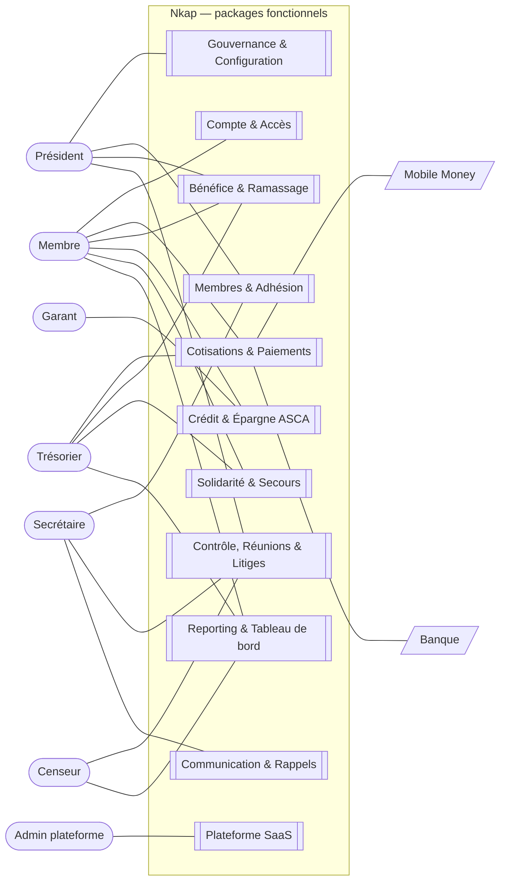
```mermaid
flowchart LR
  M([Membre])
  T([Trésorier])
  P([Président])
  S([Secrétaire])
  C([Censeur])
  G([Garant])
  AD([Admin plateforme])
  MM[/Mobile Money/]
  BK[/Banque/]

  subgraph Nkap["Nkap — packages fonctionnels"]
    P1[["Compte & Accès"]]
    P2[["Gouvernance & Configuration"]]
    P3[["Membres & Adhésion"]]
    P4[["Cotisations & Paiements"]]
    P5[["Bénéfice & Ramassage"]]
    P6[["Crédit & Épargne ASCA"]]
    P7[["Solidarité & Secours"]]
    P8[["Contrôle, Réunions & Litiges"]]
    P9[["Communication & Rappels"]]
    P10[["Reporting & Tableau de bord"]]
    P11[["Plateforme SaaS"]]
  end

  M --- P1 & P4 & P5 & P6 & P7 & P10
  T --- P4 & P5 & P7 & P10
  P --- P2 & P3 & P5 & P8
  S --- P3 & P8 & P9
  C --- P8 & P10
  G --- P6
  AD --- P11
  P4 --- MM & BK
```

### 1.3 Catalogue exhaustif (🆕 = ajout issu du retour Gemini)

| Package                               | Cas d'utilisation                                                                                                                                                                                                                                                                                                                              |
| ------------------------------------- | ---------------------------------------------------------------------------------------------------------------------------------------------------------------------------------------------------------------------------------------------------------------------------------------------------------------------------------------------- |
| **P1 · Compte & Accès**               | S'inscrire (OTP SMS) · Se connecter (mot de passe / biométrie) · Gérer son profil · Gérer ses préférences de notification                                                                                                                                                                                                                      |
| **P2 · Gouvernance & Configuration**  | Créer une tontine · Choisir le type (rotative / enchères / ASCA / secours / mixte) · Configurer les règles (montant/part, fréquence, ordre de bénéfice, pénalités, intérêts) · **Configurer les caisses internes (principale, sociale, pénalités, épargne) 🆕** · Démarrer / Suspendre / Clôturer / Archiver · Gérer le calendrier des séances |
| **P3 · Membres & Adhésion**           | Inviter (code / lien) · Rejoindre · **Parrainage & validation d'adhésion (multi-garants + bureau) 🆕** · Attribuer les rôles · Définir le nombre de parts (« mains ») · Suspendre / Exclure · Quitter · Remplacer un membre                                                                                                                    |
| **P4 · Cotisations & Paiements**      | Cotiser (cash / MoMo / OM / virement) · Enregistrer une cotisation (trésorier) · Cotiser en avance / plusieurs parts · Rapprocher un paiement · Appliquer les pénalités de retard · **Compenser / transférer entre caisses internes (wallet) 🆕** · Consulter solde & historique · **Consulter le grand-livre (transparence)**                 |
| **P5 · Bénéfice & Ramassage**         | Déterminer le bénéficiaire (ordre fixe / tirage / par besoin) · **Placer une enchère** · Clôturer un round & décaisser **(net des dettes du bénéficiaire) 🆕** · Échanger / reporter un tour · **Céder / racheter une part — « achat de la main » 🆕**                                                                                         |
| **P6 · Crédit & Épargne (ASCA)**      | Demander un prêt · Approuver / refuser (comité) · Définir échéancier & taux · Rembourser · Suivre les intérêts · Partager les bénéfices en fin de cycle                                                                                                                                                                                        |
| **P7 · Solidarité & Secours**         | Cotiser au fonds · Déclarer un événement (décès / maladie / naissance) · Demander une aide · Approuver & verser un secours                                                                                                                                                                                                                     |
| **P8 · Contrôle, Réunions & Litiges** | Approuver une action sensible (multi-validations) · Tenir une réunion / consigner un PV · Voter une décision · **Contrôler les comptes (censeur / audit)** · Gérer les amendes (absence…) · Ouvrir / résoudre un litige                                                                                                                        |
| **P9 · Communication & Rappels**      | Rappels d'échéance · Notifier (cotisation reçue, tour à venir, retard) · Diffuser une annonce                                                                                                                                                                                                                                                  |
| **P10 · Reporting & Tableau de bord** | Relevé individuel · Bilan de cycle / tontine · Exporter (PDF / Excel) · Tableau de bord (KPIs)                                                                                                                                                                                                                                                 |
| **P11 · Plateforme SaaS (Admin)**     | Superviser les organisations · Gérer abonnements / facturation · Gérer plans & quotas · Paramétrer devises / langues / frais · Support & modération                                                                                                                                                                                            |

### 1.4 Hors périmètre V1 (décidé Claude + Gemini)

- **FX (change de devises dynamique) : EXCLU.** Une tontine = **une devise de base**. Le membre à l'étranger paie via un moyen qui convertit ⇒ la caisse reçoit le montant exact en devise de base. Pas d'oracle de change, pas de comptabilité FX.
- **P11 facturation automatique : gardée dans le design, codée en dernier** (onboarding manuel des premières tontines).

### 1.5 Impact sur le modèle (à traiter au diagramme de classes)

Le **wallet inter-caisses 🆕** introduit la notion de **Caisse / Fund** (sous-compte d'une tontine : principale, sociale, pénalités, épargne). Chaque `LedgerEntry` sera rattachée à une Caisse ; le solde d'un membre est dérivé **par caisse** ; le décaissement fait une **compensation nette** des dettes avant versement. On l'intègre ensemble au diagramme de classes.

---

## 2. Diagramme de composants (microservices)

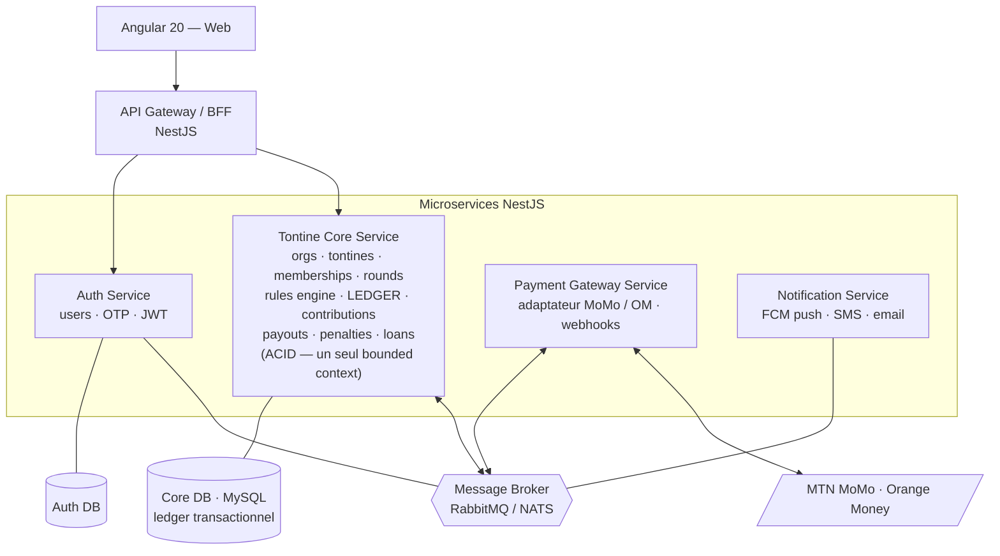
```mermaid
flowchart TB
  Client["Angular 20 — Web"]
  GW["API Gateway / BFF<br/>NestJS"]
  subgraph Services["Microservices NestJS"]
    Auth["Auth Service<br/>users · OTP · JWT"]
    Core["Tontine Core Service<br/>orgs · tontines · memberships · rounds<br/>rules engine · LEDGER · contributions<br/>payouts · penalties · loans<br/>(ACID — un seul bounded context)"]
    Pay["Payment Gateway Service<br/>adaptateur MoMo / OM · webhooks"]
    Notif["Notification Service<br/>FCM push · SMS · email"]
  end
  Broker{{"Message Broker<br/>RabbitMQ / NATS"}}
  AuthDB[("Auth DB")]
  CoreDB[("Core DB · MySQL<br/>ledger transactionnel")]
  MM[/"MTN MoMo · Orange Money"/]
  Client --> GW
  GW --> Auth
  GW --> Core
  Auth --- AuthDB
  Core --- CoreDB
  Core <--> Broker
  Pay <--> Broker
  Notif --- Broker
  Auth --- Broker
  Pay <--> MM
```

---

## 3. Diagramme de classes

### 3.1 Noyau financier (P4–P7 + Ledger + Caisse) — _validé Claude + Gemini_

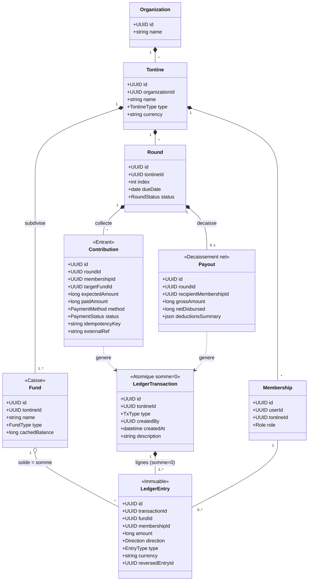
```mermaid
classDiagram
  class Organization {
    +UUID id
    +string name
  }
  class Tontine {
    +UUID id
    +UUID organizationId
    +string name
    +TontineType type
    +string currency
  }
  class Fund {
    <<Caisse>>
    +UUID id
    +UUID tontineId
    +string name
    +FundType type
    +long cachedBalance
  }
  class Membership {
    +UUID id
    +UUID userId
    +UUID tontineId
    +Role role
  }
  class Round {
    +UUID id
    +UUID tontineId
    +int index
    +date dueDate
    +RoundStatus status
  }
  class Contribution {
    <<Entrant>>
    +UUID id
    +UUID roundId
    +UUID membershipId
    +UUID targetFundId
    +long expectedAmount
    +long paidAmount
    +PaymentMethod method
    +PaymentStatus status
    +string idempotencyKey
    +string externalRef
  }
  class Payout {
    <<Decaissement net>>
    +UUID id
    +UUID roundId
    +UUID recipientMembershipId
    +long grossAmount
    +long netDisbursed
    +json deductionsSummary
  }
  class LedgerTransaction {
    <<Atomique somme=0>>
    +UUID id
    +UUID tontineId
    +TxType type
    +UUID createdBy
    +datetime createdAt
    +string description
  }
  class LedgerEntry {
    <<Immuable>>
    +UUID id
    +UUID transactionId
    +UUID fundId
    +UUID membershipId
    +long amount
    +Direction direction
    +EntryType type
    +string currency
    +UUID reversedEntryId
  }

  Organization "1" *-- "*" Tontine
  Tontine "1" *-- "1..*" Fund : subdivise
  Tontine "1" *-- "*" Membership
  Tontine "1" *-- "*" Round
  Round "1" *-- "*" Contribution : collecte
  Round "1" *-- "0..1" Payout : decaisse
  Fund "1" o-- "*" LedgerEntry : solde = somme
  LedgerTransaction "1" *-- "2..*" LedgerEntry : lignes (somme=0)
  Membership "1" -- "0..*" LedgerEntry
  Contribution ..> LedgerTransaction : genere
  Payout ..> LedgerTransaction : genere
```

> ✅ **Modèle complet** : voir **3.3** (Moteur de règles), **3.4** (Identité & Tenancy), **3.5** (Cycle & Bénéfice), **3.6** (Gouvernance & Audit). Le diagramme **3.2** ci-dessous est l'ancienne vue simplifiée, conservée pour historique.

### 3.2 Vue d'ensemble du domaine _(v1 — à étendre ; ici le Ledger est simplifié, voir 3.1 pour la version à jour)_

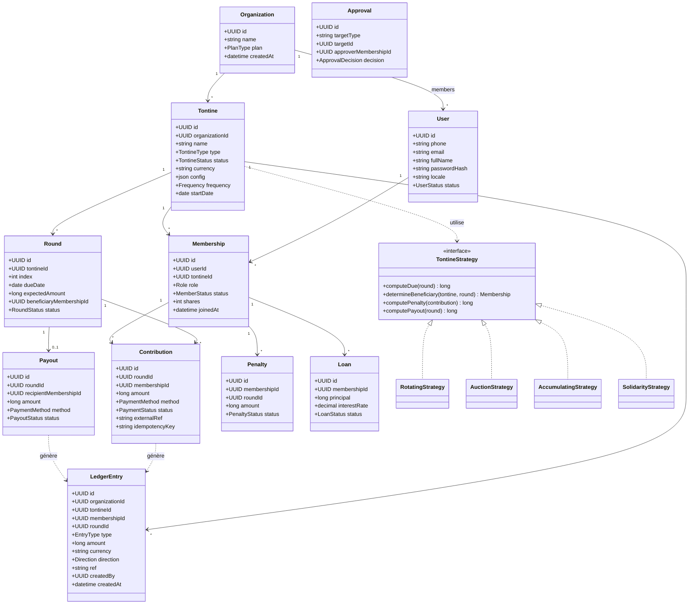
```mermaid
classDiagram
  class Organization {
    +UUID id
    +string name
    +PlanType plan
    +datetime createdAt
  }
  class User {
    +UUID id
    +string phone
    +string email
    +string fullName
    +string passwordHash
    +string locale
    +UserStatus status
  }
  class Tontine {
    +UUID id
    +UUID organizationId
    +string name
    +TontineType type
    +TontineStatus status
    +string currency
    +json config
    +Frequency frequency
    +date startDate
  }
  class Membership {
    +UUID id
    +UUID userId
    +UUID tontineId
    +Role role
    +MemberStatus status
    +int shares
    +datetime joinedAt
  }
  class Round {
    +UUID id
    +UUID tontineId
    +int index
    +date dueDate
    +long expectedAmount
    +UUID beneficiaryMembershipId
    +RoundStatus status
  }
  class LedgerEntry {
    +UUID id
    +UUID organizationId
    +UUID tontineId
    +UUID membershipId
    +UUID roundId
    +EntryType type
    +long amount
    +string currency
    +Direction direction
    +string ref
    +UUID createdBy
    +datetime createdAt
  }
  class Contribution {
    +UUID id
    +UUID roundId
    +UUID membershipId
    +long amount
    +PaymentMethod method
    +PaymentStatus status
    +string externalRef
    +string idempotencyKey
  }
  class Payout {
    +UUID id
    +UUID roundId
    +UUID recipientMembershipId
    +long amount
    +PaymentMethod method
    +PayoutStatus status
  }
  class Penalty {
    +UUID id
    +UUID membershipId
    +UUID roundId
    +long amount
    +PenaltyStatus status
  }
  class Loan {
    +UUID id
    +UUID membershipId
    +long principal
    +decimal interestRate
    +LoanStatus status
  }
  class Approval {
    +UUID id
    +string targetType
    +UUID targetId
    +UUID approverMembershipId
    +ApprovalDecision decision
  }
  class TontineStrategy {
    <<interface>>
    +computeDue(round) long
    +determineBeneficiary(tontine, round) Membership
    +computePenalty(contribution) long
    +computePayout(round) long
  }
  class RotatingStrategy
  class AuctionStrategy
  class AccumulatingStrategy
  class SolidarityStrategy

  Organization "1" --> "*" Tontine
  Organization "1" --> "*" User : members
  User "1" --> "*" Membership
  Tontine "1" --> "*" Membership
  Tontine "1" --> "*" Round
  Tontine "1" --> "*" LedgerEntry
  Round "1" --> "*" Contribution
  Round "1" --> "0..1" Payout
  Membership "1" --> "*" Contribution
  Membership "1" --> "*" Penalty
  Membership "1" --> "*" Loan
  Contribution ..> LedgerEntry : génère
  Payout ..> LedgerEntry : génère
  TontineStrategy <|.. RotatingStrategy
  TontineStrategy <|.. AuctionStrategy
  TontineStrategy <|.. AccumulatingStrategy
  TontineStrategy <|.. SolidarityStrategy
  Tontine ..> TontineStrategy : utilise
```

---

### 3.3 Moteur de règles (BC2) — Strategy + RuleSet

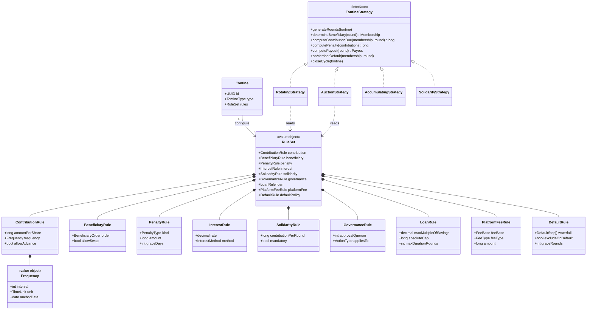
```mermaid
classDiagram
  class Tontine {
    +UUID id
    +TontineType type
    +RuleSet rules
  }
  class TontineStrategy {
    <<interface>>
    +generateRounds(tontine)
    +determineBeneficiary(round) Membership
    +computeContributionDue(membership, round) long
    +computePenalty(contribution) long
    +computePayout(round) Payout
    +onMemberDefault(membership, round)
    +closeCycle(tontine)
  }
  class RotatingStrategy
  class AuctionStrategy
  class AccumulatingStrategy
  class SolidarityStrategy
  class RuleSet {
    <<value object>>
    +ContributionRule contribution
    +BeneficiaryRule beneficiary
    +PenaltyRule penalty
    +InterestRule interest
    +SolidarityRule solidarity
    +GovernanceRule governance
    +LoanRule loan
    +PlatformFeeRule platformFee
    +DefaultRule defaultPolicy
  }
  class ContributionRule {
    +long amountPerShare
    +Frequency frequency
    +bool allowAdvance
  }
  class Frequency {
    <<value object>>
    +int interval
    +TimeUnit unit
    +date anchorDate
  }
  class BeneficiaryRule {
    +BeneficiaryOrder order
    +bool allowSwap
  }
  class PenaltyRule {
    +PenaltyType kind
    +long amount
    +int graceDays
  }
  class InterestRule {
    +decimal rate
    +InterestMethod method
  }
  class SolidarityRule {
    +long contributionPerRound
    +bool mandatory
  }
  class GovernanceRule {
    +int approvalQuorum
    +ActionType appliesTo
  }
  class LoanRule {
    +decimal maxMultipleOfSavings
    +long absoluteCap
    +int maxDurationRounds
  }
  class PlatformFeeRule {
    +FeeBase feeBase
    +FeeType feeType
    +long amount
  }
  class DefaultRule {
    +DefaultStep[] waterfall
    +bool excludeOnDefault
    +int graceRounds
  }
  Tontine "1" --> "1" RuleSet : configure
  TontineStrategy <|.. RotatingStrategy
  TontineStrategy <|.. AuctionStrategy
  TontineStrategy <|.. AccumulatingStrategy
  TontineStrategy <|.. SolidarityStrategy
  RuleSet *-- ContributionRule
  RuleSet *-- BeneficiaryRule
  RuleSet *-- PenaltyRule
  RuleSet *-- InterestRule
  RuleSet *-- SolidarityRule
  RuleSet *-- GovernanceRule
  RuleSet *-- LoanRule
  RuleSet *-- PlatformFeeRule
  RuleSet *-- DefaultRule
  ContributionRule *-- Frequency
  RotatingStrategy ..> RuleSet : reads
  AuctionStrategy ..> RuleSet : reads
```

> `DefaultRule.waterfall` par défaut = `[GUARANTOR, SAFETY_FUND, MUTUALIZE]` (décision #15).

### 3.4 Identité & Tenancy (BC1)

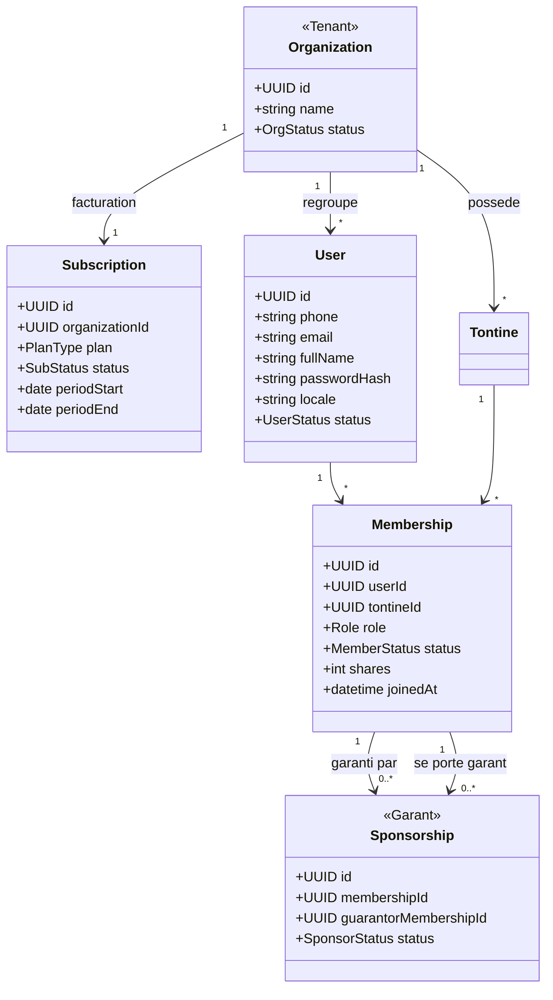
```mermaid
classDiagram
  class Organization {
    <<Tenant>>
    +UUID id
    +string name
    +OrgStatus status
  }
  class Subscription {
    +UUID id
    +UUID organizationId
    +PlanType plan
    +SubStatus status
    +date periodStart
    +date periodEnd
  }
  class User {
    +UUID id
    +string phone
    +string email
    +string fullName
    +string passwordHash
    +string locale
    +UserStatus status
  }
  class Membership {
    +UUID id
    +UUID userId
    +UUID tontineId
    +Role role
    +MemberStatus status
    +int shares
    +datetime joinedAt
  }
  class Sponsorship {
    <<Garant>>
    +UUID id
    +UUID membershipId
    +UUID guarantorMembershipId
    +SponsorStatus status
  }
  class Tontine {
  }
  Organization "1" --> "*" User : regroupe
  Organization "1" --> "1" Subscription : facturation
  Organization "1" --> "*" Tontine : possede
  User "1" --> "*" Membership
  Tontine "1" --> "*" Membership
  Membership "1" --> "0..*" Sponsorship : garanti par
  Membership "1" --> "0..*" Sponsorship : se porte garant
```

### 3.5 Cycle & Bénéfice (BC3)

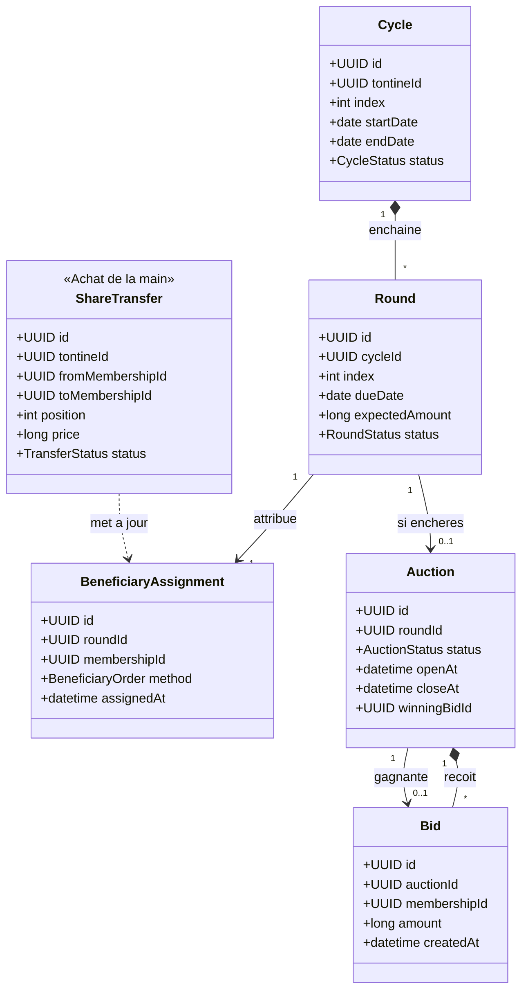
```mermaid
classDiagram
  class Cycle {
    +UUID id
    +UUID tontineId
    +int index
    +date startDate
    +date endDate
    +CycleStatus status
  }
  class Round {
    +UUID id
    +UUID cycleId
    +int index
    +date dueDate
    +long expectedAmount
    +RoundStatus status
  }
  class BeneficiaryAssignment {
    +UUID id
    +UUID roundId
    +UUID membershipId
    +BeneficiaryOrder method
    +datetime assignedAt
  }
  class Auction {
    +UUID id
    +UUID roundId
    +AuctionStatus status
    +datetime openAt
    +datetime closeAt
    +UUID winningBidId
  }
  class Bid {
    +UUID id
    +UUID auctionId
    +UUID membershipId
    +long amount
    +datetime createdAt
  }
  class ShareTransfer {
    <<Achat de la main>>
    +UUID id
    +UUID tontineId
    +UUID fromMembershipId
    +UUID toMembershipId
    +int position
    +long price
    +TransferStatus status
  }
  Cycle "1" *-- "*" Round : enchaine
  Round "1" --> "1" BeneficiaryAssignment : attribue
  Round "1" --> "0..1" Auction : si encheres
  Auction "1" *-- "*" Bid : recoit
  Auction "1" --> "0..1" Bid : gagnante
  ShareTransfer ..> BeneficiaryAssignment : met a jour
```

### 3.6 Gouvernance & Audit (BC5)

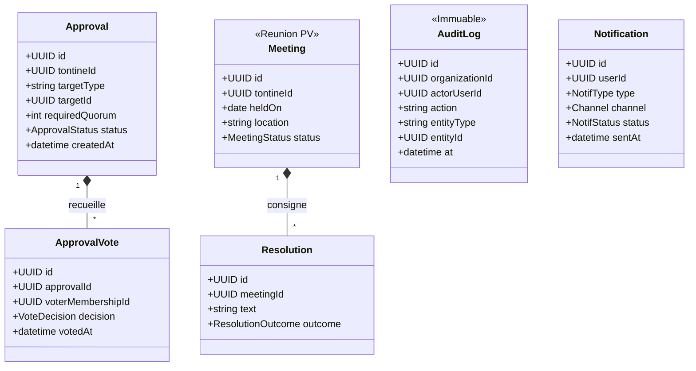
```mermaid
classDiagram
  class Approval {
    +UUID id
    +UUID tontineId
    +string targetType
    +UUID targetId
    +int requiredQuorum
    +ApprovalStatus status
    +datetime createdAt
  }
  class ApprovalVote {
    +UUID id
    +UUID approvalId
    +UUID voterMembershipId
    +VoteDecision decision
    +datetime votedAt
  }
  class Meeting {
    <<Reunion PV>>
    +UUID id
    +UUID tontineId
    +date heldOn
    +string location
    +MeetingStatus status
  }
  class Resolution {
    +UUID id
    +UUID meetingId
    +string text
    +ResolutionOutcome outcome
  }
  class AuditLog {
    <<Immuable>>
    +UUID id
    +UUID organizationId
    +UUID actorUserId
    +string action
    +string entityType
    +UUID entityId
    +datetime at
  }
  class Notification {
    +UUID id
    +UUID userId
    +NotifType type
    +Channel channel
    +NotifStatus status
    +datetime sentAt
  }
  Approval "1" *-- "*" ApprovalVote : recueille
  Meeting "1" *-- "*" Resolution : consigne
```

---

## 4. Diagrammes de séquence

### 4.1 Enregistrer une cotisation (manuelle, par le trésorier)

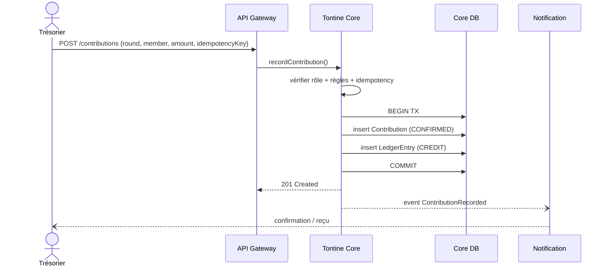
```mermaid
sequenceDiagram
  actor T as Trésorier
  participant GW as API Gateway
  participant Core as Tontine Core
  participant DB as Core DB
  participant Notif as Notification
  T->>GW: POST /contributions {round, member, amount, idempotencyKey}
  GW->>Core: recordContribution()
  Core->>Core: vérifier rôle + règles + idempotency
  Core->>DB: BEGIN TX
  Core->>DB: insert Contribution (CONFIRMED)
  Core->>DB: insert LedgerEntry (CREDIT)
  Core->>DB: COMMIT
  Core-->>GW: 201 Created
  Core--)Notif: event ContributionRecorded
  Notif--)T: confirmation / reçu
```

### 4.2 Clôturer un round et payer le bénéficiaire

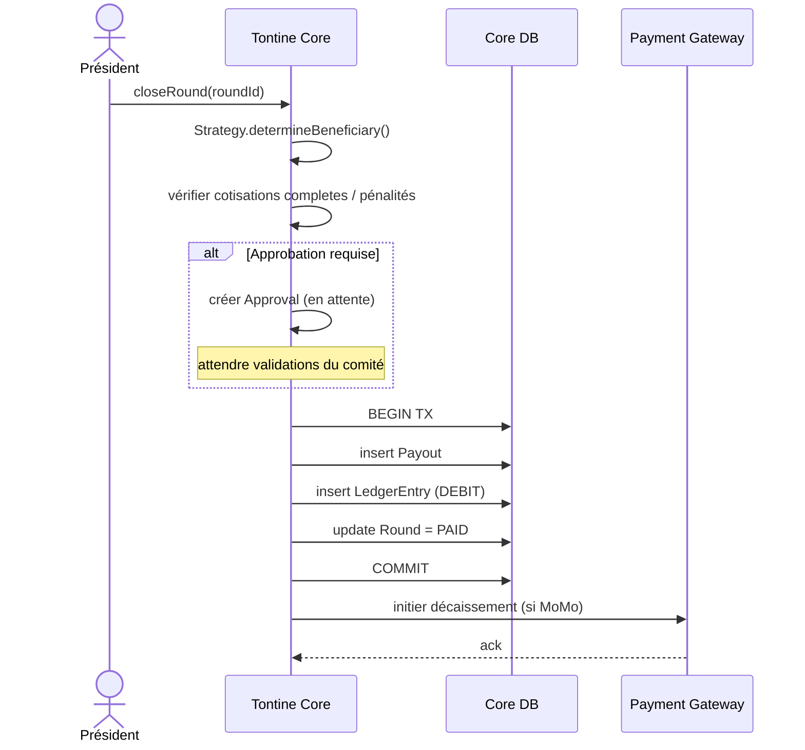
```mermaid
sequenceDiagram
  actor P as Président
  participant Core as Tontine Core
  participant DB as Core DB
  participant Pay as Payment Gateway
  P->>Core: closeRound(roundId)
  Core->>Core: Strategy.determineBeneficiary()
  Core->>Core: vérifier cotisations completes / pénalités
  alt Approbation requise
    Core->>Core: créer Approval (en attente)
    Note over Core: attendre validations du comité
  end
  Core->>DB: BEGIN TX
  Core->>DB: insert Payout
  Core->>DB: insert LedgerEntry (DEBIT)
  Core->>DB: update Round = PAID
  Core->>DB: COMMIT
  Core->>Pay: initier décaissement (si MoMo)
  Pay-->>Core: ack
```

### 4.3 Paiement Mobile Money confirmé (asynchrone)

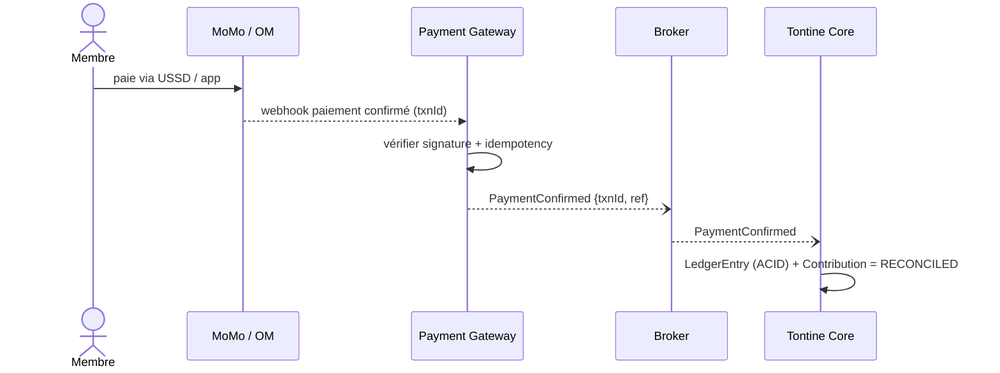
```mermaid
sequenceDiagram
  actor M as Membre
  participant MM as MoMo / OM
  participant Pay as Payment Gateway
  participant Broker as Broker
  participant Core as Tontine Core
  M->>MM: paie via USSD / app
  MM-->>Pay: webhook paiement confirmé (txnId)
  Pay->>Pay: vérifier signature + idempotency
  Pay--)Broker: PaymentConfirmed {txnId, ref}
  Broker--)Core: PaymentConfirmed
  Core->>Core: LedgerEntry (ACID) + Contribution = RECONCILED
```

---

### 4.4 Défaut d'un membre (waterfall configurable)

```mermaid
sequenceDiagram
  participant Core as Tontine Core
  participant DB as Core DB (Ledger)
  Note over Core: membre en défaut prolongé
  Core->>Core: Obligation = DEFAULTED ; lire DefaultRule
  alt 1) Garant disponible
    Core->>DB: TX — débit Garant / crédit caisse manquante
  else 2) Sinon caisse de secours
    Core->>DB: TX — débit Caisse Secours / crédit caisse manquante
  else 3) Dernier recours : mutualisation
    Core->>DB: TX — répartir le manque sur les membres restants
  end
  Core->>DB: Membership = EXCLUDED ; Obligation conservée (dette)
  Core--)Core: event MemberDefaulted (notifications)
```

### 4.5 Créer & configurer une tontine

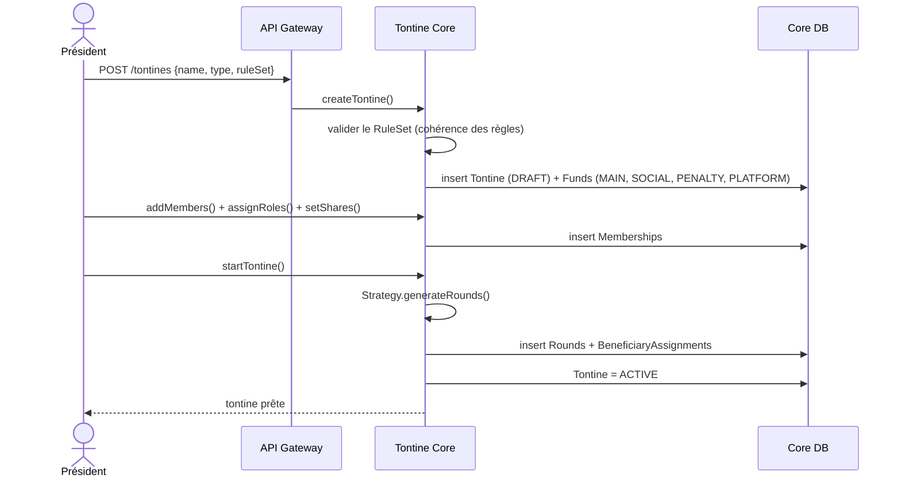
```mermaid
sequenceDiagram
  actor P as Président
  participant GW as API Gateway
  participant Core as Tontine Core
  participant DB as Core DB
  P->>GW: POST /tontines {name, type, ruleSet}
  GW->>Core: createTontine()
  Core->>Core: valider le RuleSet (cohérence des règles)
  Core->>DB: insert Tontine (DRAFT) + Funds (MAIN, SOCIAL, PENALTY, PLATFORM)
  P->>Core: addMembers() + assignRoles() + setShares()
  Core->>DB: insert Memberships
  P->>Core: startTontine()
  Core->>Core: Strategy.generateRounds()
  Core->>DB: insert Rounds + BeneficiaryAssignments
  Core->>DB: Tontine = ACTIVE
  Core-->>P: tontine prête
```

### 4.6 Onboarding membre (parrainage multi-garants)

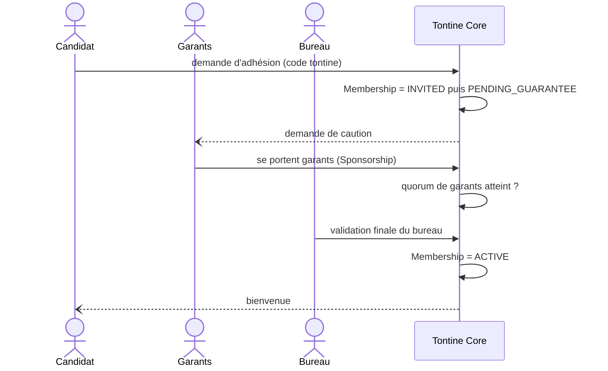
```mermaid
sequenceDiagram
  actor New as Candidat
  actor G as Garants
  actor B as Bureau
  participant Core as Tontine Core
  New->>Core: demande d'adhésion (code tontine)
  Core->>Core: Membership = INVITED puis PENDING_GUARANTEE
  Core--)G: demande de caution
  G->>Core: se portent garants (Sponsorship)
  Core->>Core: quorum de garants atteint ?
  B->>Core: validation finale du bureau
  Core->>Core: Membership = ACTIVE
  Core--)New: bienvenue
```

### 4.7 Round à enchères

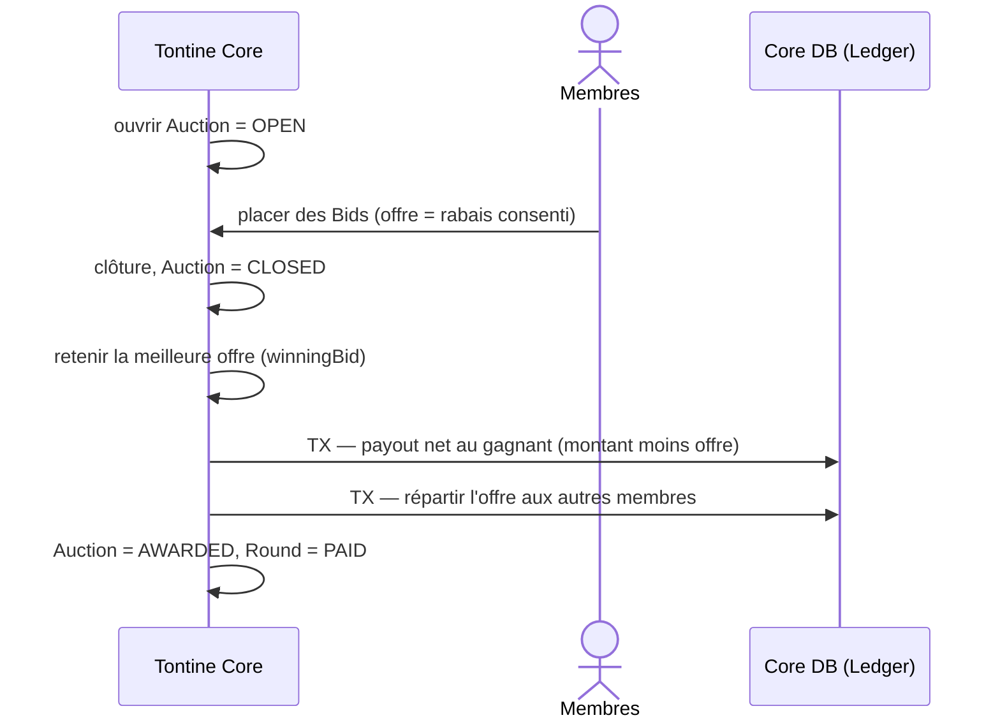
```mermaid
sequenceDiagram
  participant Core as Tontine Core
  actor M as Membres
  participant DB as Core DB (Ledger)
  Core->>Core: ouvrir Auction = OPEN
  M->>Core: placer des Bids (offre = rabais consenti)
  Core->>Core: clôture, Auction = CLOSED
  Core->>Core: retenir la meilleure offre (winningBid)
  Core->>DB: TX — payout net au gagnant (montant moins offre)
  Core->>DB: TX — répartir l'offre aux autres membres
  Core->>Core: Auction = AWARDED, Round = PAID
```

### 4.8 Prêt ASCA (cycle complet)

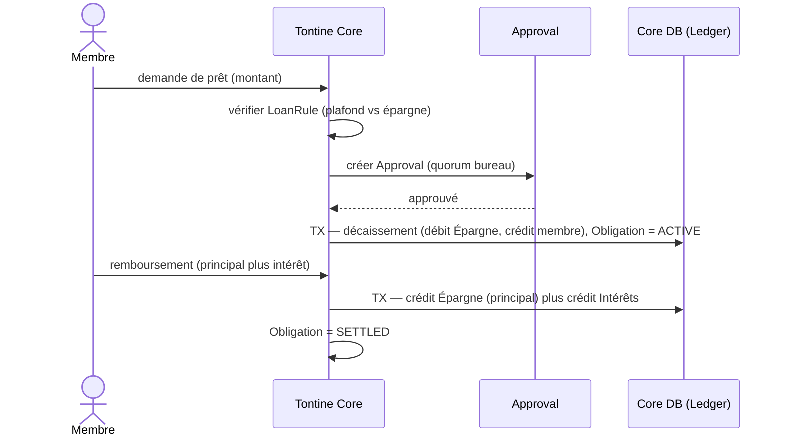
```mermaid
sequenceDiagram
  actor M as Membre
  participant Core as Tontine Core
  participant Appr as Approval
  participant DB as Core DB (Ledger)
  M->>Core: demande de prêt (montant)
  Core->>Core: vérifier LoanRule (plafond vs épargne)
  Core->>Appr: créer Approval (quorum bureau)
  Appr-->>Core: approuvé
  Core->>DB: TX — décaissement (débit Épargne, crédit membre), Obligation = ACTIVE
  M->>Core: remboursement (principal plus intérêt)
  Core->>DB: TX — crédit Épargne (principal) plus crédit Intérêts
  Core->>Core: Obligation = SETTLED
```

### 4.9 Réclamation de solidarité

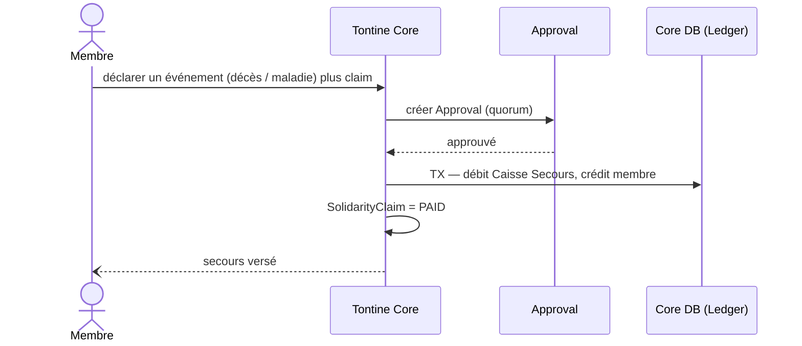
```mermaid
sequenceDiagram
  actor M as Membre
  participant Core as Tontine Core
  participant Appr as Approval
  participant DB as Core DB (Ledger)
  M->>Core: déclarer un événement (décès / maladie) plus claim
  Core->>Appr: créer Approval (quorum)
  Appr-->>Core: approuvé
  Core->>DB: TX — débit Caisse Secours, crédit membre
  Core->>Core: SolidarityClaim = PAID
  Core--)M: secours versé
```

### 4.10 Cession de part (« achat de la main »)

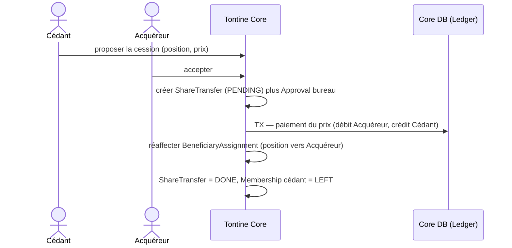
```mermaid
sequenceDiagram
  actor S as Cédant
  actor A as Acquéreur
  participant Core as Tontine Core
  participant DB as Core DB (Ledger)
  S->>Core: proposer la cession (position, prix)
  A->>Core: accepter
  Core->>Core: créer ShareTransfer (PENDING) plus Approval bureau
  Core->>DB: TX — paiement du prix (débit Acquéreur, crédit Cédant)
  Core->>Core: réaffecter BeneficiaryAssignment (position vers Acquéreur)
  Core->>Core: ShareTransfer = DONE, Membership cédant = LEFT
```

### 4.11 Application de pénalité

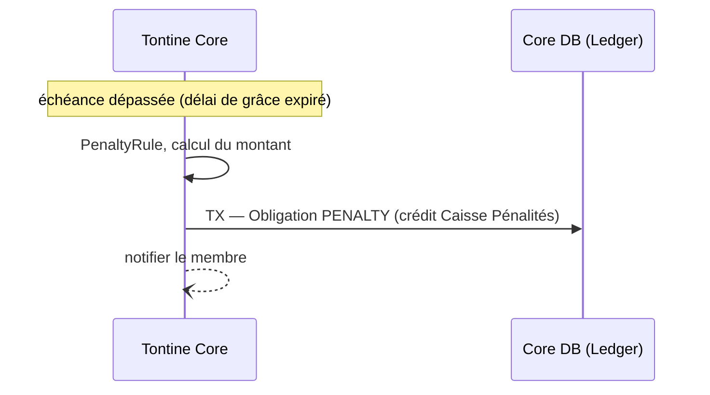
```mermaid
sequenceDiagram
  participant Core as Tontine Core
  participant DB as Core DB (Ledger)
  Note over Core: échéance dépassée (délai de grâce expiré)
  Core->>Core: PenaltyRule, calcul du montant
  Core->>DB: TX — Obligation PENALTY (crédit Caisse Pénalités)
  Core--)Core: notifier le membre
```

### 4.12 Contre-passation (reversal)

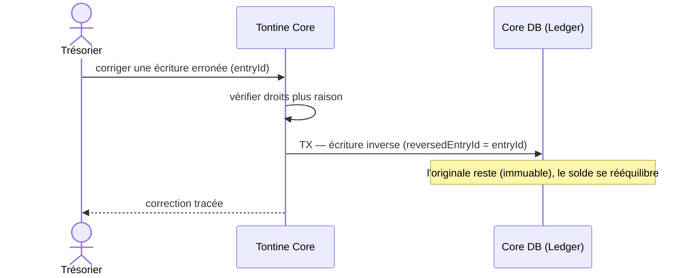
```mermaid
sequenceDiagram
  actor T as Trésorier
  participant Core as Tontine Core
  participant DB as Core DB (Ledger)
  T->>Core: corriger une écriture erronée (entryId)
  Core->>Core: vérifier droits plus raison
  Core->>DB: TX — écriture inverse (reversedEntryId = entryId)
  Note over DB: l'originale reste (immuable), le solde se rééquilibre
  Core-->>T: correction tracée
```

---

## 5. Diagrammes d'états

### 5.1 Cycle de vie d'une Tontine

```mermaid
stateDiagram-v2
  [*] --> DRAFT
  DRAFT --> OPEN : configuration validée
  OPEN --> ACTIVE : membres complets / démarrage
  ACTIVE --> SUSPENDED : incident
  SUSPENDED --> ACTIVE : reprise
  ACTIVE --> COMPLETED : tous les rounds payés
  DRAFT --> CANCELLED
  OPEN --> CANCELLED
  COMPLETED --> [*]
  CANCELLED --> [*]
```

### 5.2 Cycle de vie d'un Round

```mermaid
stateDiagram-v2
  [*] --> SCHEDULED
  SCHEDULED --> COLLECTING : date d'ouverture
  COLLECTING --> OVERDUE : échéance dépassée
  OVERDUE --> COLLECTING : régularisation
  COLLECTING --> READY : cotisations complètes
  OVERDUE --> READY : complété + pénalités
  READY --> PAID : payout au bénéficiaire
  PAID --> CLOSED
  CLOSED --> [*]
```

### 5.3 Statut d'une Cotisation / Paiement

```mermaid
stateDiagram-v2
  [*] --> PENDING
  PENDING --> CONFIRMED : validé (cash) / callback OK
  PENDING --> FAILED : rejet
  CONFIRMED --> RECONCILED : rapproché au relevé
  CONFIRMED --> REVERSED : contre-passation
  FAILED --> [*]
  RECONCILED --> [*]
  REVERSED --> [*]
```

### 5.4 Cycle de vie d'une Obligation / d'un Prêt

```mermaid
stateDiagram-v2
  [*] --> PENDING
  PENDING --> ACTIVE : approuvée / décaissée
  PENDING --> REJECTED : refusée
  ACTIVE --> PARTIALLY_SETTLED : remboursement partiel
  PARTIALLY_SETTLED --> SETTLED : soldée
  ACTIVE --> SETTLED : soldée
  ACTIVE --> DEFAULTED : défaut prolongé
  DEFAULTED --> SETTLED : couverte (garant / secours)
  DEFAULTED --> WRITTEN_OFF : passée en perte
  REJECTED --> [*]
  SETTLED --> [*]
  WRITTEN_OFF --> [*]
```

### 5.5 Cycle de vie d'un Membership

```mermaid
stateDiagram-v2
  [*] --> INVITED
  INVITED --> PENDING_GUARANTEE : parrainage requis
  PENDING_GUARANTEE --> ACTIVE : garants + bureau OK
  INVITED --> ACTIVE : sans parrainage
  ACTIVE --> SUSPENDED : sanction / impayé
  SUSPENDED --> ACTIVE : régularisé
  ACTIVE --> LEFT : départ / cession de part
  ACTIVE --> EXCLUDED : défaut
  LEFT --> [*]
  EXCLUDED --> [*]
```

### 5.6 Cycle de vie d'une Approbation

```mermaid
stateDiagram-v2
  [*] --> OPEN
  OPEN --> APPROVED : quorum atteint (APPROVE)
  OPEN --> REJECTED : quorum atteint (REJECT)
  OPEN --> EXPIRED : délai dépassé
  APPROVED --> [*]
  REJECTED --> [*]
  EXPIRED --> [*]
```

### 5.7 Cycle de vie d'une Enchère

```mermaid
stateDiagram-v2
  [*] --> SCHEDULED
  SCHEDULED --> OPEN : ouverture
  OPEN --> CLOSED : clôture
  CLOSED --> AWARDED : meilleure offre retenue
  OPEN --> CANCELLED : annulée
  AWARDED --> [*]
  CANCELLED --> [*]
```
